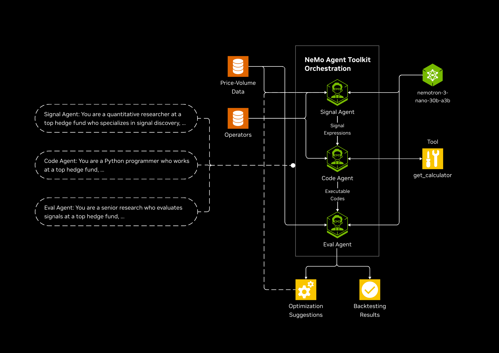

# Quant Factor Mining Agent developer example

An end-to-end factor mining workflow for quantitative finance using NVIDIA NeMo Agent Toolkit. This workflow demonstrates how to leverage LLMs to automatically generate, code, and evaluate alpha factors.

## Overview

Factor mining is the process of discovering quantitative signals (factors) that have predictive power for future stock returns. This workflow automates the traditional labor-intensive process using LLMs.

### Workflow Architecture



The workflow uses a **closed-loop optimization** approach:
1. Generate factor ideas using an LLM
2. Convert ideas to executable Python code
3. Evaluate the factor's predictive power (Rank IC)
4. If IC meets threshold → Accept and save
5. If IC is poor → Generate optimization advice and retry

## Getting Started

### Prerequisites

- **Platform:** Linux, macOS, or Windows
- **Python:** version 3.11, 3.12, or 3.13
- **Package manager:** pip or uv

### API Keys

You will need an NVIDIA API key. Get yours from [build.nvidia.com](https://build.nvidia.com/settings/api-keys).

```bash
export NVIDIA_API_KEY="your-api-key-here"
```

### Installing Dependencies

```bash
uv venv
source .venv/bin/activate
uv pip install -e .
```

### Download Data

The workflow requires S&P 500 price-volume data (Open, Close, High, Low, Volume). Use the included script to download fresh data via [yfinance](https://github.com/ranaroussi/yfinance):

```bash
python -m factor_mining_workflow.download_data
```

You can customize the date range:

```bash
python -m factor_mining_workflow.download_data --start 2015-01-01 --end 2025-12-31
```

> **Disclaimer:** Each user is responsible for checking the content of datasets and the applicable licenses and determining if suitable for the intended use.

## Deployment Options

This workflow can be deployed in two ways:

### Option 1: Interactive Notebook Deployment

Best for exploration, experimentation, and learning. The notebook provides step-by-step execution with inline documentation.

```bash
# Activate virtual environment
source .venv/bin/activate

# Launch Jupyter
jupyter notebook notebooks/factor-mining-workflow.ipynb
```

The notebook includes:
- API key setup
- Configuration exploration
- Step-by-step workflow execution
- Interactive result visualization
- Ability to modify parameters on-the-fly

### Option 2: CLI Deployment

Best for production, automation, and scripting. Run the workflow directly from the command line.

#### Basic Usage

```bash
# Run the factor mining workflow
nat run --config_file configs/config-optimization.yml --input "momentum factors"
```

#### With Phoenix Tracing (Recommended)

For full observability with LLM tracing, run Phoenix in a separate terminal first:

**Terminal 1 - Start Phoenix Server:**
```bash
source .venv/bin/activate
phoenix serve
```

Phoenix will start at http://localhost:6006

**Terminal 2 - Run the Workflow:**
```bash
source .venv/bin/activate
export NVIDIA_API_KEY="your-api-key-here"
nat run --config_file configs/config-optimization.yml --input "momentum factors"
```

View traces at http://localhost:6006 to see:
- LLM calls and responses
- Token usage
- Latency metrics
- Full execution trace

#### Running Different Factor Types

```bash
# Generate volatility factors
nat run --config_file configs/config-optimization.yml --input "volatility factors"

# Generate mean reversion factors
nat run --config_file configs/config-optimization.yml --input "mean reversion factors"

# Generate volume-based factors
nat run --config_file configs/config-optimization.yml --input "volume price divergence factors"
```

## Components

| Component | Description |
|-----------|-------------|
| **Factor Agent** | Uses an LLM to generate factor expressions based on price-volume data and operators |
| **Code Agent** | Converts factor expressions into executable Python code using the `Get_calculator` tool |
| **Eval Agent** | Performs backtesting via Rank IC and generates optimization suggestions |
| **Data Download Script** | Fetches S&P 500 price-volume data from Yahoo Finance via `yfinance` |

## Configuration

The workflow configuration is defined in `configs/config-optimization.yml`:

> **Note:** The `base_url` for the LLMs depends on your API key. Set it to either:
> - `https://integrate.api.nvidia.com/v1/` — for keys from [build.nvidia.com](https://build.nvidia.com)
> - `https://inference-api.nvidia.com/v1/` — for NVIDIA internal or enterprise API keys

| Parameter | Description |
|-----------|-------------|
| `factor_generator_llm` | LLM for generating factor expressions (higher temperature for creativity) |
| `code_generator_llm` | LLM for converting expressions to executable code (lower temperature for precision) |
| `optimization_advisor_llm` | LLM for generating optimization feedback (balanced temperature) |
| `ic_threshold` | Minimum absolute IC value to accept a factor (e.g., 0.02 = 2%) |
| `p_value_threshold` | Maximum p-value for statistical significance (e.g., 0.05 = 5%) |
| `max_iterations` | Maximum number of optimization iterations before accepting best result |
| `num_factors` | Number of factors to generate per iteration |
| `forward_periods` | Number of days for forward return calculation (e.g., 5 = weekly) |
| `save_results` | Whether to save successful factors to disk |

## Evaluation Metrics

| Metric | Description | Good Value |
|--------|-------------|------------|
| **Mean IC** | Average Spearman correlation between factor and forward returns | \|IC\| > 0.03 |
| **IC Std** | Standard deviation of IC values | Lower is more consistent |
| **IC IR** | Information Ratio = Mean IC / IC Std | > 0.5 is good |
| **T-statistic** | Statistical significance of mean IC | \|t\| > 2 is significant |
| **P-value** | Probability IC is different from zero | < 0.05 is significant |
| **Positive IC Ratio** | Fraction of periods with positive IC | > 0.55 is good |

### Understanding Sample IC vs Mean IC

- **Sample IC**: Quick evaluation of factor quality during generation. Computed on a single pass through the data.
- **Mean IC**: The average rank correlation computed across all time periods (e.g., 3,246 daily observations). This is the final evaluation metric used for acceptance decisions.

## Project Structure

```
quant-factor-mining-agent/
├── configs/
│   └── config-optimization.yml
├── notebooks/
│   ├── factor-mining-workflow.ipynb
│   └── images/
│       └── workflow-architecture.png
├── pyproject.toml
├── README.md
└── src/
    └── factor_mining_workflow/
        ├── __init__.py
        ├── data/sp500/           # S&P 500 price-volume data
        ├── download_data.py      # Script to fetch data via yfinance
        ├── factor_code_generator.py
        ├── factor_evaluator.py
        ├── factor_generator.py
        ├── factor_mining_optimization_workflow.py
        ├── register.py
        └── template/
            ├── calculator.json
            └── factor_output_template.json
```

## Additional Resources

- [NeMo Agent Toolkit Documentation](https://docs.nvidia.com/nemo-agent-toolkit/)
- [Arize Phoenix Documentation](https://arize.com/docs/phoenix)

## License

See LICENSE file for details.
